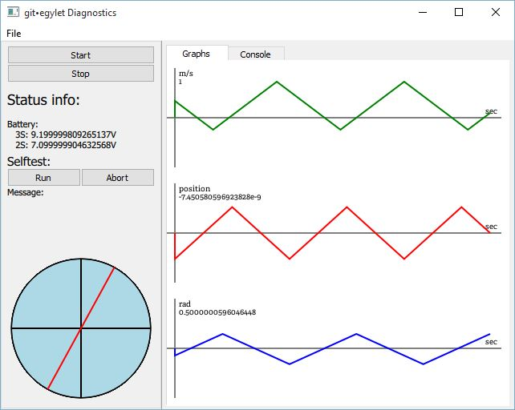
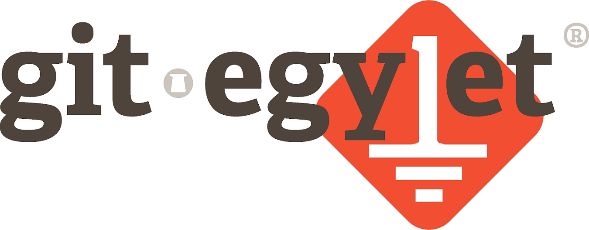

# Alkalmazásfejlesztés házifeladat tapasztalatok

## Csapatban fejlesztésről

A feladatot három fős csapatban kellett elvégeznünk félévünk során, ahhoz, hogy hatékonyan tudjunk haladni igyekeztünk jól elkülöníthető 
részfeladatokat találni, emlékezve a tanult Modell View Control tervezési elvre végül e szerint alakítottuk ki a feladatainkat. 
Így mindenki a fejlesztés nagy részében saját branchen, külön tudott dolgozni, kihasználva a verziókezelés előnyeit. 

Féléves elfoglaltságaink miatt csak meglehetősen megkésve álltunk neki a tényleges munkának, viszont a tanult fejlesztési módszereket alkalmazva, 
gyorsan, könnyen együttműködve haladtunk, így rövid idő alatt sikerült nagy mennyiségű de letisztult kódot írnunk. 

## Tervezési mintákról

Kezdetben megpróbáltuk az egész feladatunkat úgy kialakítani, hogy tervezési mintát tudjunk ráhúzni, ez nem bizonyult hatékonynak. 
Később mikor már jobban megismertük a mintákat illetve a feladatunkat, feltérképezve a lehetőségeket az aktuális feladatban találtuk meg 
a minták megfelelő helyét.

## Felhasználói felület

Egyik legérdekesebb részfeladatnak a felhsználói felület megfelelő kialakítását gondoltuk, tapasztalatlan QML és Cpp fejlesztőként - korábbi andoidos xml tapasztalatokal - 
kezdetben meglehetősen nehézkes volt megfelelően összeileszten a két környezetet, hibákat keresni. Szerencsére a Qt online elérhető dokumentációja igényes
így ezen nehézségek kis keresgélés után feloldódtak. 

## QML tmogatott adattípusok
Grafikonok rajzolása során futottunk bele abba a hibába miszerint, float típusú listát szerettünk volna QML oldalról elérni,ez sokadik próbálkozásra sem 
tűnt úgy, hogy működőképes lesz. Alapértelmezetten át kellett volna alakítania a float típusunkat QML számára is értelmezhető real típussá, végül a problémát
float helyett Qreal típusú lista használatával sikerült megoldnai

<small>Szerzők: Divald Voktor, Nagy Bálint Máté, Szabó Oszkár Albert</small>

