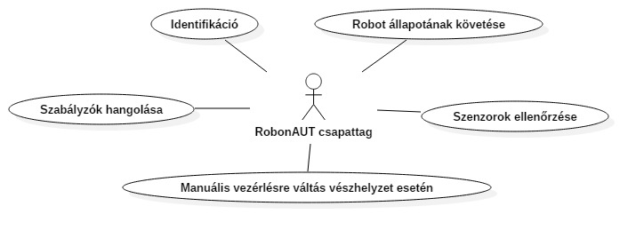
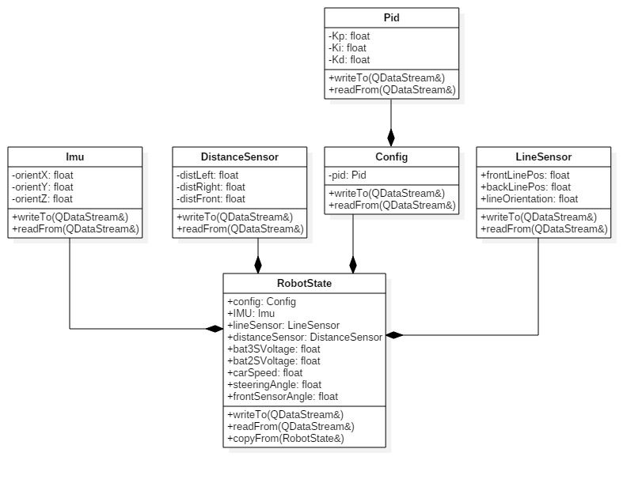
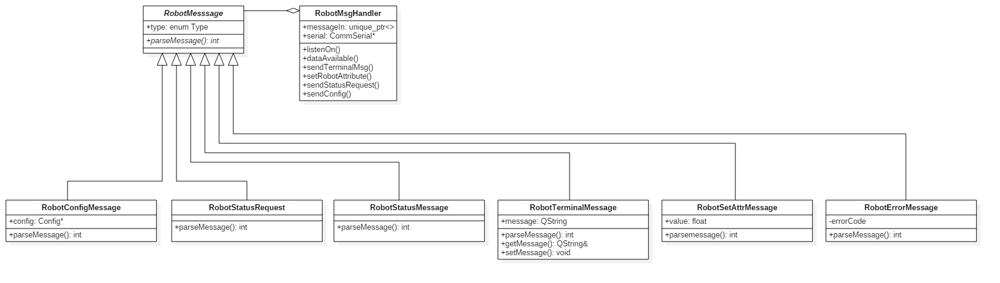
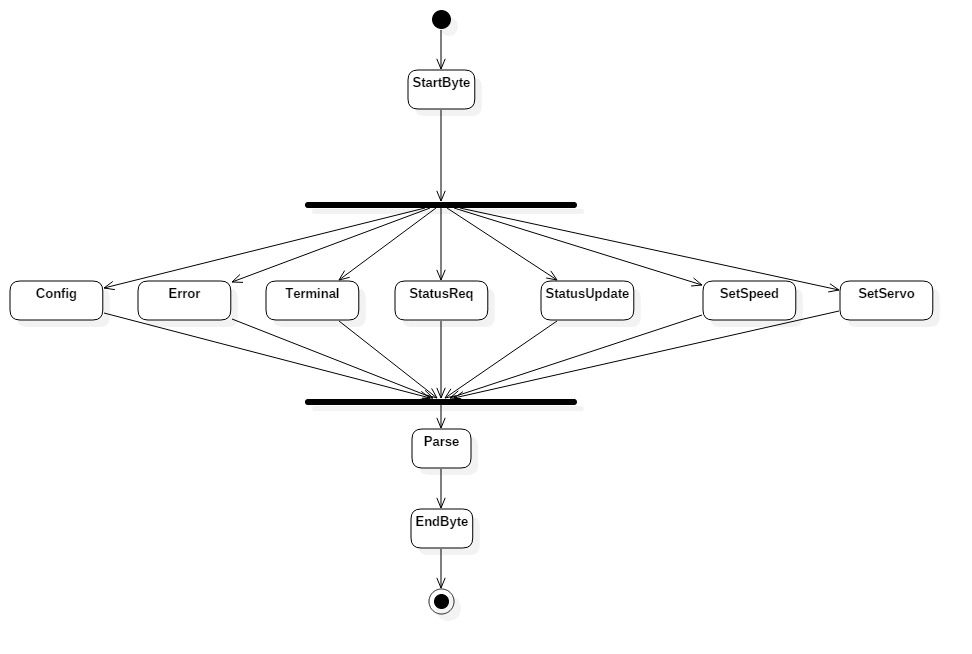
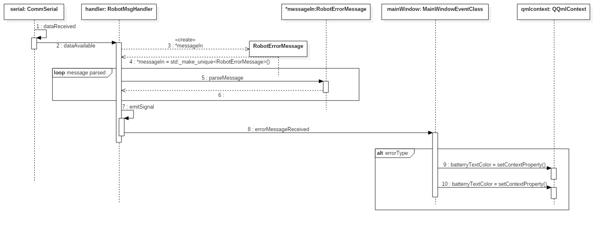

@mainpage
@tableofcontents
@section Feladat A feladat specifikációja
A félév során a feladat egy, a RobonAUT versenyre való felkészülést megkönnyítő QT alkalmazás ltérehozása volt. Egy ilyen, grafkius user interfésszel rendelkező diagnosztikai program számos előnnyel bír egy hasonló jellegű versenyre való készülődéskor. Az alkalmazás lehetséges felhasználási területei közül láthatunk néhányat az alábbi use-case diagramon.

A vonalkövető autó megfelelő elkészítésének megkönnyítésén túl azonban a feladat célja az Alkalmazásfejlesztés tárgyból minél jobb jegy elérése, tehát a fejlesztés folyamán - természetesen - figyelembe kellett vennünk a tárgy házi feladatának követelményeit is.

@section Demo Demo videó
Az alábbi linken található Demo video szemlélteti az alkalmazás működését:

https://www.youtube.com/watch?v=xH18M2hmOtA&feature=youtu.be

Sajnos technikai nehézségből bőven adódott a videó rögzítésekor
- A videón sajnos nincs hang
- A videó rögzítése során az autónk nagyon messze volt a használható állapottól, ezért a bejövő adatok az STM32F4 discovery által 'szimulált' adatok. E miatt nem látható változás a sebesség és kormányszög váloztatásánál a self test során.

@section Alkalmazas Az alkalmazás felépítése
Az alkalmazés elkészítése során törekedtünk a Model-View-Controller archtitektúra szerint történő fejlesztésre. Azaz igyekeztünk az osztályainkat, funkcióinkat úgy szétválasztani, hogy az elvégzett feladataik az alábbi kategóriák egyikébe, és lehetőleg kizárólag az egyikbe essenek
- A robot állapotleírásának reprezentációja, a robot állapotainak tárolása, a felhasználói felület feltöltése adatokkal, új adatok lekérdezésének kezdeményezése
- A felhasználói felület felépítése, megjelenítése, lehetőség a user számára a beavatkozásra
- Új adatok biztosítása a robot állapotleírásához, kommunikáció kezelése, üzenetek küldése fogadása

@section Allapot A robot állapotleírása
A robot egy időpillanthoz tartozó állapotát egy RobotState osztály fogja össze. Ez a robotra jellemző adatokat tartalmazza (vonalszenzor adatai, szabályozó paraméterek, akku feszültség, autó sebesség, lásd: a linkelt osztályt), melyet az alábbi osztálydiagram szemléltet.

A robot állapota periodikusan lekérdezésre kerül. Ezt a szolgáltatást az UpdateRequest osztály biztosítja egy QTimer segítségével. A robottól fogadott új státuszüzenet elmentődik egy RobotState példányba, melyet egy RobotStateHistory objektum eltárol.

A RobotStateHistory osztály megvalósít egy tárolót (std::vector), aminek az elemei RobotState példányokra mutató unique pointerek. Ezen felül tárolja az utolsó N db elemet külön QList listákban is, mivel a QML csak ezeket tudja feldolgozni. A robot aktuális állapotára mindig mutat a RobotStateHistory::currentState pointer.

Mivel a program egyéb komponenseinek szüksége van az új állapotra, ezért új állapot eltárolása után egy szignál kerül kibocsátásra.

@section Kommunikacio Kommunikáció
@subsection Kapcsolat Kapcsolat a robottal
A robottal a kapcsolat soros porton keresztül létezik. Ennek fenntartásáért a CommSerial osztály felel, melynek QSerialPort tagváltozóján keresztül kezelhető maga a soros port.

Az üzenetek küldése és fogadása is streameken keresztül történik. A küldő függvénnyel bármilyen olyan objektum elküldhető, mely magát QDataStream-be képes írni. Az üzenetek fogadásához bekötésre került a QSerialPort readyRead() signalja, melyet az osztály dataReceived() slotja dolgoz fel. Ez nem tesz mást, mint a bejövő streamet továbbítja a dataAvailable() signaljának segítségével további feldolgozásra. Fontos, hogy az előbbi signal kiadásakor még nem biztos, hogy a teljes üzenet megérkezett, erre a későbbi feldolgozást végző osztályokban figyelni kell.

@subsection Uzenetfeldolgozas Az üzenettípusok
Az üzenetek feldolgozása a Strategy tervezési minta alaján történik. Az üzenetfeldolgozást végző osztályok UML diagramja az alábbi ábrán látató.

Minden üzenet típus a közös absztrakt RobotMessage ősosztályból származik le. Ez rendelkezik egy publikus belső enum osztállyal, melyben a lehetséges üzenetek típusai vannak felsorolva. Az ősosztálynak van is egy ilyen RobotMessage::Type típusú tagváltozója, melyet minden leszármazott osztály megörököl és magának köteles kitölteni.

Az osztály rendelkezik egy virtuális parseMessage() függvénnyel, melyet minden leszármazott osztály megvalósít. Ennek a feladat, hogy a bemeneteként kapott streamből az üzenetet beolvassa.

Ezen kívül található az ősosztályban még egy std::uniqueptr<RobotMessage> típusú pointer is. Ehhez a mutatóhoz az üzenet feldolgozása során, az üzenet típusát már feldolgozva fog létrejönni egy leszármazott típusú objektmu, amire a messageIn pointer fog mutatni, majd a messageIn-re a parseMessage() függvényt meghívva a leszármazott osztály azonos függvénye fog lefutni.

Ezzel megoldható, hogy a beérkező üzenetek típusa által meghatározott módon, különböző algoritmusok szerint olvassák be magukat, így megvalósítva a Strategy tervezési mintát.  

@subsection Feldolgozas A bejövő üzenetek feldolgozása
A bejövő üzenetek feldolgozása a következő állapotdiagramon látszik.

Az üzenetet egy fejléc byte előzi meg, ezt a típust jelző azonosító követi. Ezután következik az értékes adat - ennek a feldolgozására képesek a RobotMessage osztály leszármazottai. Ezután pedig hibaellenőrzési célból egy lezáró byte kerül átvitelre.

A robot hibaüzeneteinek, azaz a RobotErrorMessage objektumoknak a beolvasását és feldolgozását szemlélteti a következő szekvenciadiagram.

A többi üzenettípus beolvasása is azonos módon történik, csak a megérkezett üzenetek felhasználásában van különbség.

A soros porton érkezett bájtokat a CommSerial osztály dataAvailable() signalja jelzi. Ezt a RobotMsgHandler megfelelő slotja fogadja, ami elkezdi az üzenet bájtok feldolgozását. A feldolgozó slot egy állapotgép, ami a fentebb ábrázolt üzenetküldési protokollon lépked végig. A slot törzse mindig csak egyszer fut le, ha maradt még bejövő üzenet akkor egy oneShot timer segítségével a slot újra meghívésra kerül.

A fejléc és az üzenettípus megfelelő beolvasását követően az üzenettípusnak megfelelő objektum kerül előállításra, amire a messageIn unique pointer mutat. Ennek az obejktumnak a messageIn pointeren kersztül való parseMessage hívása a leszármazott osztály megfelelő függvényét hívja, mely elvégzi az üzenet beolvasását.

Az értékes adat feldolgozása mindaddig tart, amíg a parseMessage() függvény 0-val tér vissza, ekkor a teljes üzenet megérkezett. Ezután  a megérkezett üzenetnek megfelelő signal meghívódik, majd hibaellenőrzési céllal beolvasásra kerül a lezáró bájt.

@section Proxy Üzenet küldés, fogadás

A bejövő és kimenő üzenetek könnyű kezeléséhez a RobotMsgHandler osztály használható, mely egy Proxy tervezési mintát valósít meg, kezelő interfészt szolgáltatva a robot üzeneteihez. A robot számára üzenetek küldése az osztály megfelelő slotjainak hívásával, a megfelelő üzenetek fogadása pedig a signaljaihoz való csatlakozással lehetséges.

@section UI A user interface
Az alkalmazásunk felhasználói felülete QML alapú GUI. A QML felelős az adatok összekapcsolásáért, változások esetén a megfelelő objektumok frissítéséért, grafikonok újrarajzolásáért, valamint gombok kezeléséért.

A ConsoleTabEventClass() kezeli a soros porthoz tartozó fület, mely segítségével üzeneteket küldhetünk és fogadhatunk soros porton, GraphTabEventClass() osztály szolgál a grafikonokat tartalmazó fül eseményeinek kezeléséért, minden új adat érkezése esetén újrarajzolja a grafikonjainkat

MainWindowEventClass() segítségével kezeljük az egyéb általánosabb UI elemeket (pl: gombok, menü)

@section Selftest A Self test funkció
